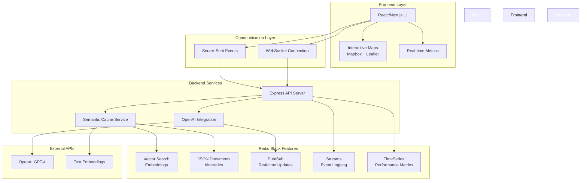

# 🌍 TravelMate AI

> An intelligent travel companion powered by Redis Stack and OpenAI, delivering personalized itineraries with semantic caching and real-time updates.

[](https://redis.io/docs/stack/)
[](https://openai.com/)
[](https://nextjs.org/)
[](https://nodejs.org/)

## 🎯 Overview

TravelMate AI revolutionizes travel planning by combining the power of Redis Stack's advanced features with OpenAI's intelligence. Get instant, personalized travel recommendations with semantic caching that learns from similar queries, delivering lightning-fast responses for better user experiences.

### ✨ Key Features

- **🧠 Semantic Caching**: Intelligent query matching using vector embeddings
- **⚡ Real-time Streaming**: Live updates during itinerary generation via Server-Sent Events
- **🗺️ Interactive Maps**: Mapbox with route visualization
- **📊 Performance Analytics**: Real-time metrics and cache performance monitoring
- **🎯 Smart Categorization**: Personalized recommendations across attractions, dining, activities, and more
- **💡 Context-Aware**: Session memory for follow-up queries and preferences

## 🏗️ Architecture



## 🚀 Quick Start

### Prerequisites

- Node.js 18+ and npm
- Docker (for Redis Stack)
- OpenAI API key

### 1. Clone & Install

```bash
git clone https://github.com/sumeetweb/Travelmate.git
cd Travelmate
npm install
cd frontend && npm install && cd ..
```

### 2. Environment Setup

Create `.env` in the root directory:

```env
OPENAI_API_KEY=your_openai_api_key_here
REDIS_URL=redis://localhost:6379
PORT=3001
```

Create `.env.local` in the `frontend` directory:

```env
NEXT_PUBLIC_API_URL=http://localhost:3001
NEXT_PUBLIC_MAPBOX_TOKEN=
```

### 3. Start Redis Stack

```bash
docker-compose up -d
```

This launches:
- Redis Stack on port 6379
- RedisInsight dashboard on port 8001

### 4. Launch Application

```bash
# Full stack development
npm run dev:full

# Or separately:
# Backend: npm run dev
# Frontend: cd frontend && npm run dev
```

Visit: http://localhost:3000

## 🎮 Usage Workflow

### 1. **Plan Your Trip**
   - Enter your destination (e.g., "Paris, France")
   - Select categories: Attractions, Dining, Activities, etc.
   - Set trip duration (1-7 days)
   - Add preferences (budget, dietary restrictions, accessibility)

### 2. **Experience Real-time Generation**
   - Watch live streaming as AI builds your itinerary
   - See cache hits for similar queries (⚡ instant responses)
   - Monitor performance metrics in real-time

### 3. **Explore Interactive Results**
   - View detailed day-by-day plans
   - Explore locations on interactive maps
   - See routes and connections between stops
   - Get estimated costs and time requirements

### 4. **Smart Follow-ups**
   - Ask questions about your itinerary
   - Request modifications or alternatives
   - Benefit from session context memory

## 🧪 Redis Stack Features Demo

### Vector Search & Semantic Caching
- **Vector Search**: Match queries using cosine similarity
- **Semantic Caching**: Reuse previous query results for faster responses

### Real-time Features
- **Pub/Sub**: Live typing indicators and updates
- **Streams**: Complete interaction logging for analytics
- **TimeSeries**: Performance metrics with sub-second precision

### Data Storage
- **JSON Documents**: Complex itinerary objects with nested data
- **Vector Embeddings**: 1536-dimension query representations
- **Cache Keys**: Intelligent semantic-based cache management

## 📁 Project Structure

```
TravelMate/
├── 🗄️ backend/
│   ├── routes/
│   │   ├── stream.js          # SSE endpoints for real-time streaming
│   │   └── travel.js          # Core travel API endpoints
│   ├── services/
│   │   ├── cache.js           # Semantic caching with vector search
│   │   ├── openai.js          # GPT-4 and embeddings integration
│   │   └── redis.js           # Redis Stack service management
│   └── server.js              # Express server with WebSocket support
├── 🖥️ frontend/
│   ├── components/
│   │   ├── StreamingDisplay.tsx    # Real-time itinerary streaming
│   │   ├── TravelMap.tsx          # Interactive map with markers
│   │   ├── MetricsDisplay.tsx     # Live performance dashboard
│   │   └── LocationInput.tsx     # Smart location search
│   ├── hooks/
│   │   ├── useStreamingQuery.ts   # SSE connection management
│   │   └── useMetrics.ts          # Real-time metrics tracking
│   └── pages/
│       └── index.tsx              # Main application interface
├── 🐳 docker-compose.yml          # Redis Stack container setup
```

## ⚡ Performance Highlights

### Semantic Caching Benefits
- **Cache Hit**: ~50-100ms response time
- **Cache Miss**: ~3-5s (fresh AI generation)
- **Similarity Threshold**: 0.95 for precise matching
- **Cost Savings**: Up to 90% reduction in OpenAI API calls

### Real-time Metrics
- Response time tracking with millisecond precision
- Cache hit rate monitoring
- Live performance dashboard
- Historical trend analysis

## 🔧 Development

### Available Scripts

```bash
# Development
npm run dev              # Backend only
npm run frontend         # Frontend only  
npm run dev:full         # Full stack with concurrency

# Production
npm run build            # Build frontend
npm start               # Production server

# Utilities
docker-compose up -d     # Start Redis Stack
docker-compose down      # Stop Redis Stack
```

### Testing Redis Features

Access RedisInsight at http://localhost:8001 to:
- Browse vector embeddings
- Monitor real-time streams
- Analyze performance metrics
- Explore JSON document structure

## 🌟 Technical Achievements

### Redis Stack Integration
- ✅ **Vector Search**: Semantic query matching with cosine similarity
- ✅ **JSON Documents**: Complex nested itinerary storage
- ✅ **Pub/Sub**: Real-time communication channels
- ✅ **Streams**: Comprehensive event logging and analytics
- ✅ **TimeSeries**: High-resolution performance monitoring

### AI & Machine Learning
- ✅ **GPT-4 Integration**: Context-aware travel planning
- ✅ **Embeddings**: 1536-dimension query vectorization
- ✅ **Semantic Matching**: Intelligent cache retrieval
- ✅ **Context Memory**: Session-based conversation flow

### Real-time Experience
- ✅ **Server-Sent Events**: Live streaming updates
- ✅ **WebSocket Support**: Bidirectional communication
- ✅ **Progressive Loading**: Smooth user experience
- ✅ **Error Recovery**: Graceful failure handling

## 🎯 Use Cases

### Travel Enthusiasts
- Quick destination research
- Multi-day itinerary planning
- Local experience discovery
- Budget-conscious travel planning

### Travel Professionals
- Client itinerary preparation
- Destination research tool
- Performance monitoring
- Cost optimization through caching

### Developers & Researchers
- Redis Stack feature demonstration
- Real-time application patterns
- Semantic caching implementation
- AI integration best practices

## 🚦 API Endpoints

### Core Travel API
- `POST /api/travel/query` - Generate travel itinerary

### Streaming API
- `POST /api/stream/query` - Real-time itinerary streaming via SSE
- `GET /api/stream/metrics` - Live performance metrics stream

### Health & Monitoring
- `GET /health` - Service health check
- `GET /metrics` - Performance metrics summary

## 🤝 Contributing

1. Fork the repository
2. Create a feature branch (`git checkout -b feature/amazing-feature`)
3. Commit your changes (`git commit -m 'Add amazing feature'`)
4. Push to the branch (`git push origin feature/amazing-feature`)
5. Open a Pull Request

## 📄 License

This project is licensed under the ISC License - see the [LICENSE](LICENSE) file for details.

## 🙏 Acknowledgments

- **Redis** for the powerful Redis Stack platform
- **OpenAI** for GPT-4 and embedding services
- **Mapbox** for interactive mapping solutions
- **Next.js & React** for the modern frontend framework
- **Express.js** for the robust backend foundation

---

<div align="center">

**Built with ❤️ for the Redis AI Challenge**


</div>